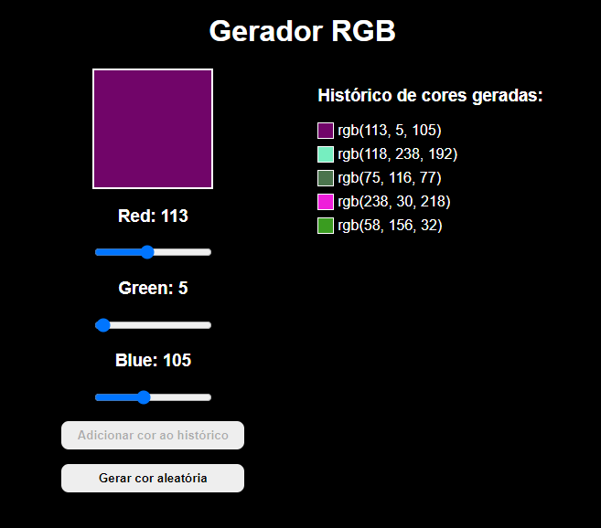

# Gerador RGB

#### Terceiro projeto do curso de React Direto ao Ponto

## 🎯 Objetivo

Este é um projeto de um gerador de RGB, que tinha como objetivo fixar o conceito de useState em React JS. Nele é possível gerar uma cor em rgb através de um input do tipo range, adicionar a cor gerada a um histórico e gerar uma cor de forma aleatória.

## 🚀 Como executar o projeto

1. Clone este repositório

`$ git clone https://github.com/giovanaraphaelli/rbg.git`

2. Acesse a pasta do projeto no seu terminal/cmd

`$ cd rgb`

3. Abra a pasta do projeto no VS Code via terminal/cmd

`$ code .`

4. Instale as dependências

`$ yarn install`

5. Execute a aplicação em modo de desenvolvimento

`$ yarn start`

6. A aplicação será aberta na porta: 3000 - acesse http://localhost:3000
